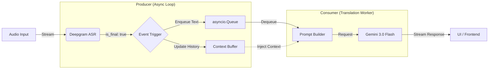

# リアルタイム同時翻訳システム アーキテクチャ設計書

## 1. 概要

本システムは、Zoomの音声をリアルタイムに文字起こしし、文脈を加味して翻訳し、
低遅延で表示するSimulST（Simultaneous Speech Translation）パイプラインである。
Deepgramによる低レイテンシASRと、Gemini 3.0 Flashによる文脈指向翻訳を組み合わせる。

## 2. 設計目標

1. **Low Latency:** 非同期パイプラインでブロッキングを排除し、遅延を最小化する。
2. **Context Awareness:** 直近の会話履歴を参照し、断片入力でも高精度に翻訳する。

## 3. システム構成図 (Data Flow)



## 4. コンポーネント詳細設計

### 4.1 Audio Input

- Zoom RTMS SDKからPCMフレームを取得し、Deepgram WebSocketへストリーミング送信する。

### 4.2 ASR: Deepgram Settings

- **Model:** `nova-2-general` (推奨) または `enhanced`
- **Key Parameters:**
  - `smart_format=true`: 句読点・数値整形を有効化し、翻訳精度を向上。
  - `endpointing=500`: 発話終了後500msの無音検知で強制的に `is_final` を発行。
  - `interim_results=true`: UI向けの体感速度改善に利用するが、翻訳トリガーには使わない。

### 4.3 MT Strategy: Contextual Sliding Window

- **Trigger:** Deepgramから `is_final: true` を受信したタイミング。
- **Prompt Structure:** `<context>` と `<target>` を分離し、文脈と翻訳対象を明示。
- **Sliding Window:**
  - 直近 3〜5文をFIFOバッファで保持。
  - 新しい文の確定ごとにバッファを更新。

### 4.4 MT Engine: Gemini 3.0 Flash

- **Mode:** `stream=true` (Streaming Generation)
- **System Instruction Example:**
  - "You are a professional simultaneous interpreter. Translate the following text
    into Japanese appropriately for the context. Output ONLY the translated text."
- **Context Caching (必須):**
  - システムプロンプトや辞書（`dictionary.csv` 等）はGeminiのContext Cachingに登録し、
    翻訳リクエストではキャッシュ参照を利用する。
  - 辞書が更新された場合は、キャッシュを破棄・再作成する。
  - 運用上は「起動時にキャッシュ生成」「更新検知で再生成」を基本とする。

### 4.5 ワークフロー制御

- LangChainは各APIの連携・エラーハンドリング・リトライ制御に利用する。

## 5. 実装ロジック (Python Asyncio)

```python
import asyncio
from collections import deque

CONTEXT_WINDOW_SIZE = 3
QUEUE_MAX_SIZE = 10

class TranslationSystem:
    def __init__(self):
        self.queue = asyncio.Queue(maxsize=QUEUE_MAX_SIZE)
        self.context_buffer = deque(maxlen=CONTEXT_WINDOW_SIZE)
        self.cached_context_id = None

    async def start(self):
        # GeminiのContext Cachingを初期化（辞書＋システムプロンプト）
        self.cached_context_id = await self.create_gemini_cache()
        await asyncio.gather(self.run_asr_producer(), self.run_mt_consumer())

    async def run_asr_producer(self):
        async with deepgram.connect(...) as socket:
            async for message in socket:
                if message.is_final:
                    transcript = message.channel.alternatives[0].transcript
                    if transcript.strip():
                        if self.queue.full():
                            try:
                                self.queue.get_nowait()
                            except asyncio.QueueEmpty:
                                pass
                        await self.queue.put(transcript)
                        self.context_buffer.append(transcript)

    async def run_mt_consumer(self):
        while True:
            current_text = await self.queue.get()
            context_str = "\n".join(list(self.context_buffer)[:-1])
            prompt = f\"\"\"<context>
{context_str}
</context>
<target>
{current_text}
</target>\"\"\"
            asyncio.create_task(self.call_gemini(prompt))

    async def call_gemini(self, prompt):
        response = await model.generate_content_async(
            prompt,
            stream=True,
            cached_context=self.cached_context_id,
        )
        async for chunk in response:
            if chunk.text:
                print(chunk.text, end="", flush=True)
        print()

    async def create_gemini_cache(self):
        # 辞書とシステムプロンプトをキャッシュ化し、IDを返す
        ...
```

## 6. エッジケースと対策

| 事象 | 対策 |
| --- | --- |
| 無音過多 | `endpointing`が効かない場合はタイムアウト監視で手動確定。 |
| 翻訳遅延 | キュー溢れ時は古い文を破棄し、最新を優先する。 |
| 幻覚 (Hallucination) | `<context>` `<target>` タグで文脈と翻訳対象を分離する。 |
| 辞書更新 | Context Cacheの再生成を実施し、IDを差し替える。 |

## 7. 今後の拡張性

- **RAG:** 専門用語辞書や会議録のVector検索を導入し、動的に用語注入。
- **Speaker Diarization:** 発話者情報を文脈に含め、口調の一貫性を向上。
- **代替ASR:** Aqua Voice / AssemblyAIの評価・切替を可能にする抽象化。
